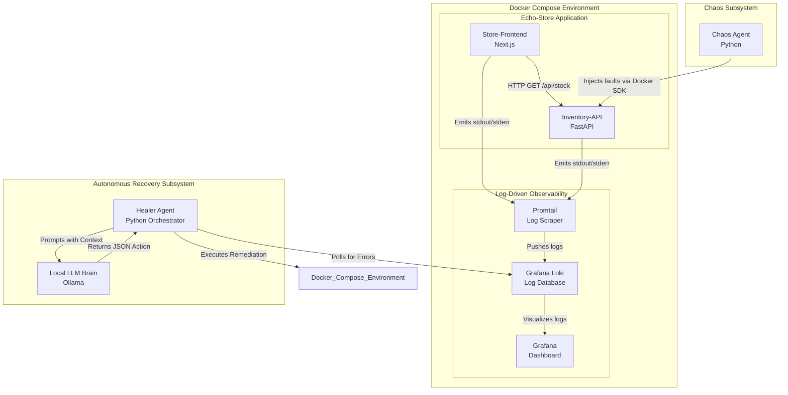

# Automated Chaos Engineering & Recovery System

[](https://www.python.org/downloads/)
[](https://fastapi.tiangolo.com)
[](https://nextjs.org/)
[](https://www.docker.com/)
[](https://grafana.com/oss/loki/)

A closed-loop autonomous system demonstrating advanced Site Reliability Engineering (SRE) and DevOps principles. This project features a local microservices environment, a Python-based Chaos Agent that intentionally injects system faults, and a Healer Agent powered by a local Large Language Model (LLM) that detects, diagnoses, and autonomously remediates the failures.

## Table of Contents

- [About the Project](#about-the-project)
- [System Architecture](#system-architecture)
- [Project Structure](#project-structure)
- [Getting Started](#getting-started)
  - [Prerequisites](#prerequisites)
  - [Installation](#installation)
- [Usage](#usage)
- [Documentation](#documentation)

## About the Project

This monorepo houses a complete, zero-cost, local engineering environment. It is designed to prove that LLMs can be securely integrated into operational pipelines to handle Level 1 / Level 2 incident response autonomously.

The environment consists of a dummy application ("Echo-Store") monitored by a log-driven observability stack. When the Chaos Agent breaks a component, the Healer Agent polls the log database for anomalies, feeds the error context to a local instance of Ollama, and executes the LLM's recommended Docker SDK commands to restore the system.

## System Architecture

The architecture relies entirely on Docker Compose and Log-Driven observability to maintain a minimal compute footprint.



## Project Structure

This monorepo separates the target application, the infrastructure configurations, and the automation agents.

```text
.
├── agents/                      # Python AI and Automation scripts
│   ├── chaos-agent/             # Injects compute and state faults
│   └── healer-agent/            # Polls Loki and queries Ollama
│
├── infra/                       # Docker Compose and monitoring configuration
│   └── monitoring/              # Promtail, Loki, and Grafana configs
│
├── services/                    # Target dummy microservices
│   ├── inventory-api/           # FastAPI backend serving static data
│   └── store-frontend/          # Next.js SSR frontend gateway
│
├── docs/                        # Architectural diagrams and specifications
└── docker-compose.yml           # Core infrastructure definition
```

## Getting Started

### Prerequisites

To run this system locally, you will need the following installed on your machine:

- Docker Desktop (or Docker Engine + Docker Compose plugin)
- Python 3.12+ (for running the Agents)
- Node.js 20.x+ (for frontend development)
- [Ollama](https://ollama.com/) (running locally with `llama3` or `mistral` pulled)

### Installation

1.  Clone the repository:

    ```bash
    git clone <your-repo-url>
    cd automated-chaos-recovery
    ```

2.  Boot the infrastructure and microservices:

    ```bash
    cd infra
    docker compose up -d
    ```

3.  Verify the observability stack is active by navigating to Grafana at `http://localhost:3001`.

4.  Install dependencies for the Python agents:

    ```bash
    # From the root directory
    cd agents/healer-agent
    pip install -r requirements.txt

    cd ../chaos-agent
    pip install -r requirements.txt
    ```

## Usage

1.  **Verify Target Health:** Navigate to the Store Frontend at `http://localhost:3000` to ensure the application is successfully fetching data from the Inventory API.
2.  **Start the Healer Agent:** In a new terminal, run the Healer Agent to begin polling Grafana Loki for error signatures.
3.  **Inject Chaos:** In another terminal, execute the Chaos Agent script to terminate or throttle the `inventory-api` container.
4.  **Observe Autonomous Recovery:** Watch the Healer Agent detect the resulting 502/504 errors in the Loki stream, query the local Ollama instance, and execute the Docker recovery command automatically.

## Documentation

Detailed functional specifications and service-level READMEs can be found below:

- [System Functional Design Document](docs/functional_design_document.md)
- [Store Frontend Documentation](services/store-frontend/README.md)
- [Inventory API Documentation](services/inventory-api/README.md)
