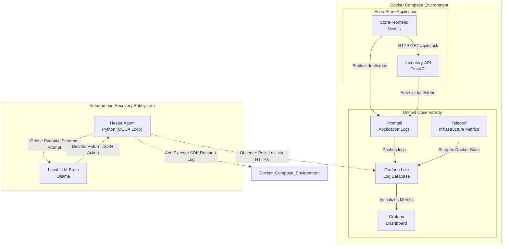

<div align="center">

# Automated Chaos Engineering & Recovery System

_A closed-loop autonomous ecosystem demonstrating advanced Site Reliability Engineering (SRE) and AI-driven DevOps principles._

[](https://www.python.org/downloads/)
[](https://fastapi.tiangolo.com)
[](https://nextjs.org/)
[](https://www.docker.com/)
[](https://grafana.com/oss/loki/)

</div>

> **⚠️ Disclaimer: Active Development** > The target microservices environment (Echo-Store), the log-driven observability infrastructure, and the autonomous **Healer Agent** are fully operational. The Python-based **Chaos Agent** (automated fault injection) is currently under active development.

---

## 📖 About the Project

This monorepo houses a complete, zero-cost, local engineering environment designed to prove that Local Large Language Models (LLMs) can be securely integrated into operational pipelines to handle Level 1 / Level 2 incident response autonomously.

The environment consists of a dummy application ("Echo-Store") monitored by a unified telemetry stack. The standout feature is the **Healer Agent**, an autonomous first responder that uses the **Observe-Orient-Decide-Act (OODA)** loop. It tails container logs and hardware metrics, feeds the error context to a local instance of Ollama, and executes Docker SDK commands to restore the system—ensuring absolute privacy with **zero data exfiltration**.

## 🏗️ System Architecture

The architecture uses a **Sanitized Telemetry Pipeline** where metrics and logs share a unified Loki backend. The Healer Agent is strictly scoped to infrastructure interventions and will safely escalate logical code bugs without altering source code.



## 📊 Observability & Dashboards

This project uses **Unified Log-Driven Metrics**. Instead of traditional exporters, system metrics are extracted from Telegraf's `logfmt` stream in Loki using precise LogQL unwrap queries.

### Visualizing Metrics in Grafana

Navigate to Grafana at `http://localhost:3001` and create **Time series** panels using the following query:

**1. CPU Utilization (%)**

```logql
avg_over_time({job="debug_metrics"} | logfmt | usage_percent != "" | unwrap usage_percent [1m]) by (container_name)
```

## ⚡ Manual Fault Injection (Testing)

To verify the Healer Agent's OODA loop, manually trigger faults from your terminal. Ensure the Healer Agent is running (`uv run python -m src.main` in the `healer-agent` directory).

| Test Profile        | Command                                                                                                                                                   | Expected Healer Action                                                  |
| :------------------ | :-------------------------------------------------------------------------------------------------------------------------------------------------------- | :---------------------------------------------------------------------- |
| **CPU Starvation**  | `docker exec -d inventory-api stress-ng --cpu 4 --timeout 60`                                                                                             | Detects metric spike -> Diagnoses starvation -> **Restarts Container**  |
| **Memory Leak**     | `docker exec -d store-frontend stress-ng --vm 1 --vm-bytes 500M --vm-populate --vm-hang 0 --temp-path /tmp --timeout 60`                                  | Detects RAM spillage -> Diagnoses OOM risk -> **Restarts Container**    |
| **Code Escalation** | `docker exec inventory-api sh -c 'echo "ERROR: Exception: TypeError: unsupported operand type(s) for +: int and str in core.py line 112" > /proc/1/fd/1'` | Catches explicit error -> Diagnoses logical bug -> **Logs & Escalates** |

## 📂 Project Structure

```text
chaos-and-recovery-agent/
├── agents/                      # Python AI and Automation scripts
│   ├── chaos-agent/             # (In Development) Automated fault injection
│   └── healer-agent/            # Live OODA loop responder (Loki -> Ollama -> Docker)
│
├── infra/                       # Docker Compose and monitoring configuration
│   └── monitoring/              # Promtail, Loki, Telegraf, and Grafana configs
│
├── services/                    # Target microservices
│   ├── inventory-api/           # FastAPI backend
│   └── store-frontend/          # Next.js SSR frontend
│
├── docker-compose.yml           # Core infrastructure definition
└── README.md                    # Project documentation
```

## 🚀 Getting Started

### Prerequisites

- **Docker Desktop** (or Docker Engine + Compose plugin)
- **Python 3.12+** (`uv` package manager recommended)
- **Ollama** (Running locally with your preferred model)

### Installation & Launch

1. **Clone the repository:**

   ```bash
   git clone https://github.com/sedna08/chaos-and-recovery-agent.git
   cd chaos-and-recovery-agent
   ```

2. **Launch Infrastructure:**

   ```bash
   docker compose up -d
   ```

3. **Start the Healer Agent:**
   ```bash
   cd agents/healer-agent
   uv run python -m src.main
   ```

---
