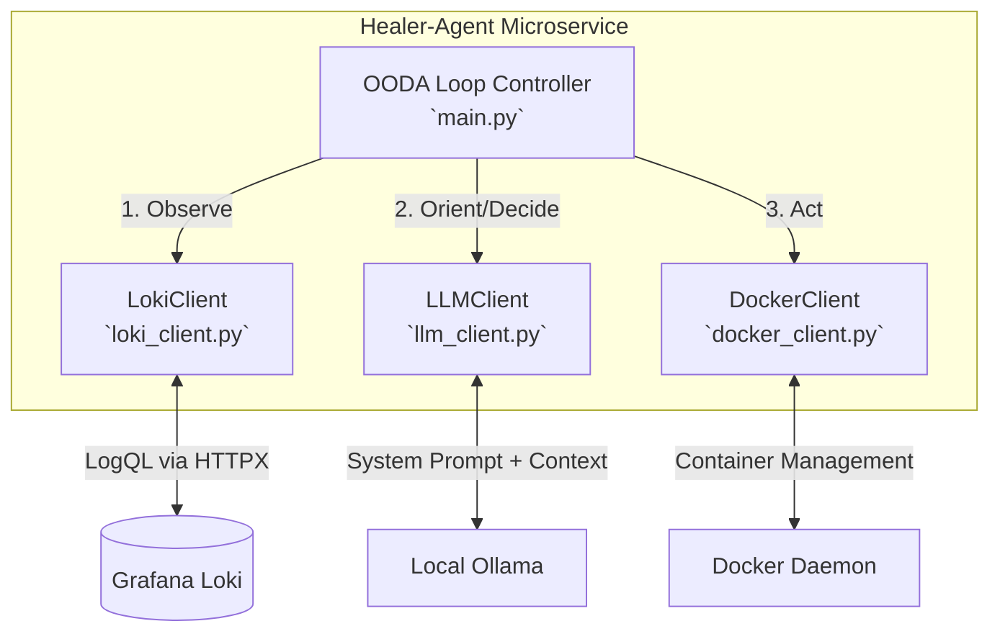
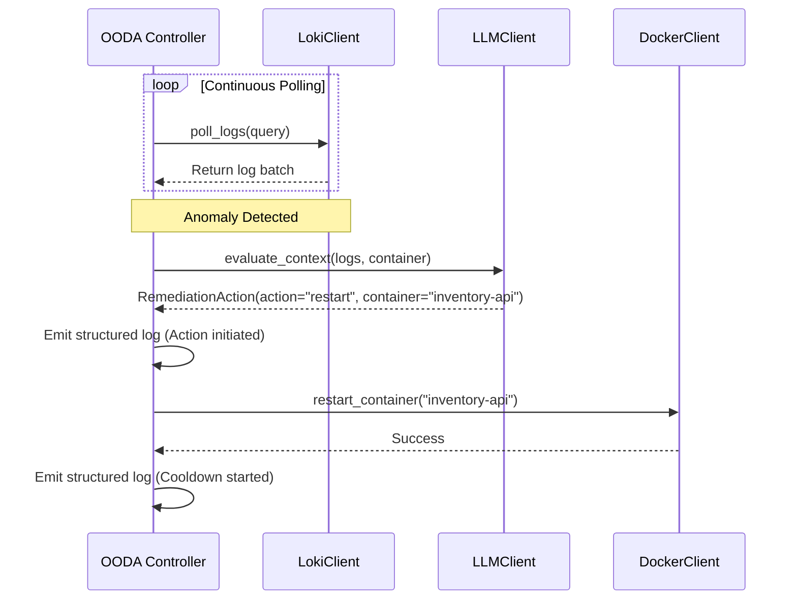

<div align="center">

# 🩹 Functional Design Document: Infrastructure Healer Agent

_The autonomous Tier-1 responder for the chaos-and-recovery-agent ecosystem._

[](https://www.python.org/downloads/)
[](https://docker-py.readthedocs.io/)
[](https://grafana.com/oss/loki/)
[](https://ollama.com/)

</div>

---

## 📖 Introduction

### 🎯 Purpose

This document outlines the functional design for the `healer-agent` microservice. As the autonomous Tier-1 responder of the ecosystem, its primary role is to continuously monitor system telemetry, diagnose application faults using a local Large Language Model (LLM), and perform infrastructure-level interventions to mitigate transient failures.

### 🔭 Scope

The service is strictly scoped to **infrastructure orchestration and diagnostic observability**. It operates as a localized watchdog, executing interventions such as container restarts to resolve operational timeouts or resource starvation.

It explicitly **does not** modify, patch, or alter application source code. Hard-coded logical bugs are escalated to human engineers via structured JSON logs.

## 🛠️ Technology Stack

The agent utilizes a modern, typed, and localized Python stack to ensure zero data exfiltration:

- **Language:** Python 3.12+
- **Dependency Management:** `uv`
- **AI Inference:** Ollama SDK (Local LLM execution, e.g., `llama3.2`)
- **Container Orchestration:** Docker SDK for Python
- **Telemetry Ingestion:** HTTPX (Polling Grafana Loki API)
- **Data Validation:** Pydantic (Enforcing LLM JSON action schemas)
- **Testing & Linting:** Pytest and Ruff

## 🏗️ Component Architecture

The application follows an event-driven, decoupled architectural pattern based on the **Observe-Orient-Decide-Act (OODA)** loop. Each phase is isolated into specific client modules to ensure single-responsibility and testability.



## 🔄 OODA Loop Implementation Details

### 1️⃣ Observe (`loki_client.py`)

The agent maintains an active polling loop against the Grafana Loki endpoint (`http://localhost:3100`). It executes predefined LogQL queries to detect anomalies:

- **Application Exceptions:** `{container=~"inventory-api|store-frontend"} |= "Exception"`
- **Hardware Starvation:** Parses `logfmt` metrics pushed by Telegraf, looking for CPU or Memory `usage_percent` crossing the 90% threshold.

### 2️⃣ Orient & Decide (`llm_client.py`)

Upon intercepting an anomaly, the agent aggregates the recent log context and forwards it to the local Ollama model. The prompt instructs the LLM to act as a diagnostic engine and return a strictly formatted JSON response validated by Pydantic models.

- **Valid Decisions:** `"restart"` (for transient/hardware issues) or `"escalate"` (for hard-coded application errors).

### 3️⃣ Act (`docker_client.py`)

The decision is parsed into a `RemediationAction` object. If the action is a restart, the agent interfaces with the local Docker daemon via the Python SDK to restart the target container. Structured JSON logs are emitted at each step for system observability.

## 🛤️ Internal Workflows

### Remediation Sequence



## 📂 Project Directory Structure

The following tree represents the internal structure of the `healer-agent/` directory. It explicitly separates external integrations (Docker, LLM, Loki) into single-responsibility modules to facilitate isolated unit testing.

```text
healer-agent/
├── pyproject.toml               # Configuration for Ruff, Pytest, and dependencies
├── uv.lock                      # Deterministic dependency resolution
├── src/                         # Main application source code
│   ├── __init__.py
│   ├── main.py                  # Core OODA loop implementation
│   ├── models.py                # Pydantic schemas (RemediationAction)
│   ├── logger.py                # Structured JSON logging utility
│   ├── loki_client.py           # HTTP polling and cursor management
│   ├── llm_client.py            # Ollama interface and prompt engineering
│   └── docker_client.py         # Infrastructure intervention execution
└── tests/                       # Unit test directory
    ├── __init__.py
    ├── test_loki_client.py      # Mocks HTTPX and verifies cursor logic
    ├── test_llm_client.py       # Mocks Ollama and verifies Pydantic parsing
    └── test_docker_client.py    # Mocks Docker daemon interactions
```
