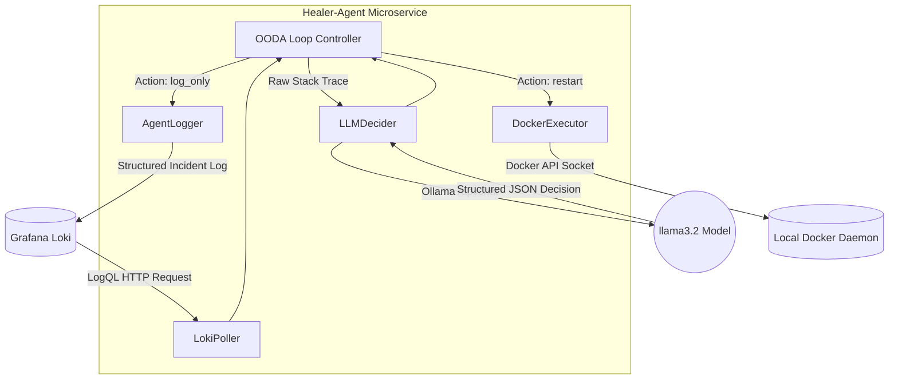
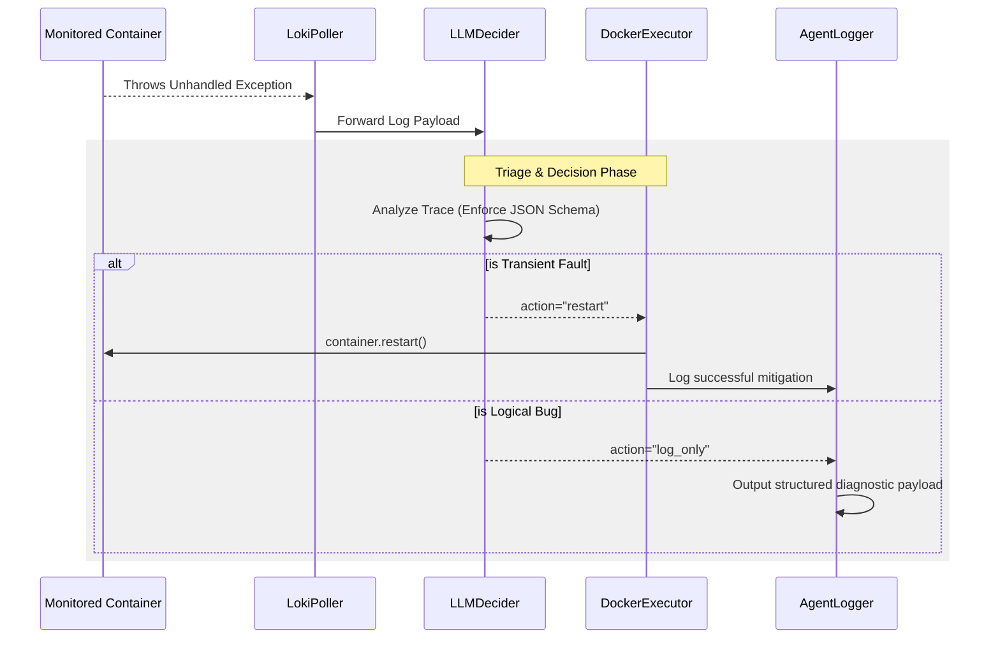
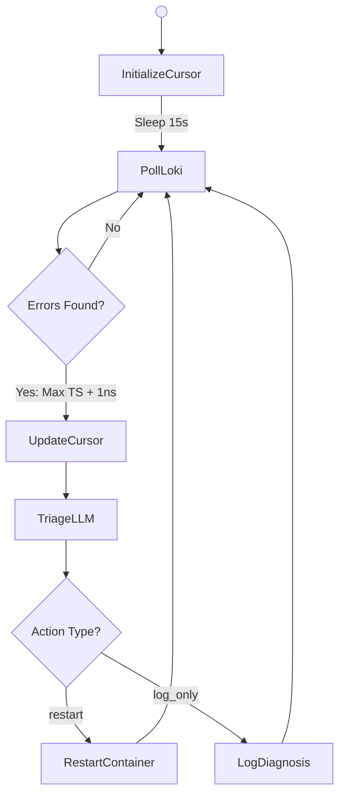
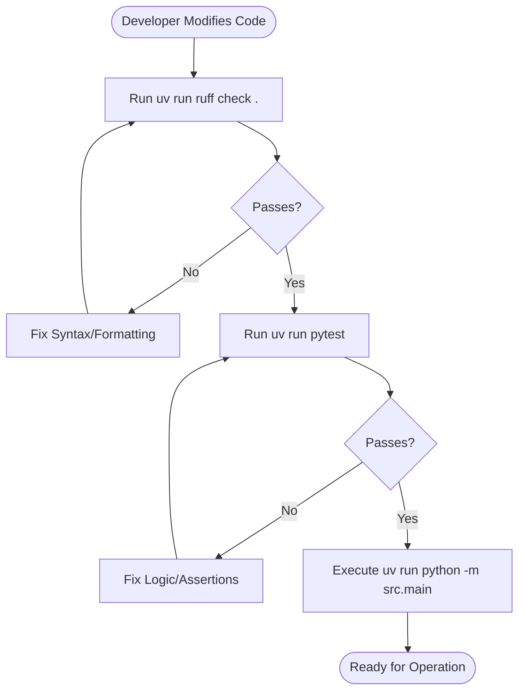

# Functional Design Document: Infrastructure Healer Agent

## 1. Introduction

### 1.1 Purpose

This document outlines the functional design for the `healer-agent` microservice. As the autonomous Tier-1 responder of the `chaos-and-recovery-agent` ecosystem, its primary role is to monitor system telemetry, diagnose application faults using a local Large Language Model (LLM), and perform infrastructure-level interventions (such as container restarts) to mitigate transient failures.

### 1.2 Scope

The service is strictly scoped to infrastructure orchestration and diagnostic observability. It explicitly **does not** modify, patch, or alter application source code. It serves as an intelligent triage system: resolving operational timeouts automatically while escalating hard-coded logical bugs to human engineers via structured logs.

## 2. Technology Stack

- **Language:** Python 3.12+
- **AI Inference:** Ollama SDK (Local LLM execution)
- **Container Orchestration:** Docker SDK for Python
- **Telemetry Ingestion:** HTTPX (Polling Grafana Loki API)
- **Data Validation:** Pydantic (Enforcing LLM JSON schemas)
- **Testing & Linting:** Pytest and Ruff

## 3. Component Architecture

The application follows an event-driven, decoupled architectural pattern based on the Observe-Orient-Decide-Act (OODA) loop.



## 4. Core Capabilities

Unlike a standard API, the Healer Agent operates as a background worker. Its capabilities are defined by the operational decisions the LLM is permitted to make.

| Decision Action | Trigger Condition                                                                        | System Response                                                                                     |
| :-------------- | :--------------------------------------------------------------------------------------- | :-------------------------------------------------------------------------------------------------- |
| `restart`       | Transient infrastructure faults (e.g., connection timeouts, deadlocks, OOM constraints). | Agent utilizes Docker SDK to restart the target container, restoring service availability.          |
| `log_only`      | Hard-coded application logic faults (e.g., `TypeError`, `KeyError`, syntax errors).      | Agent aborts intervention and outputs a structured diagnostic summary for human engineering review. |

## 5. System Workflows

### 5.1 Request Lifecycle (Sequence Diagram)

This diagram illustrates the autonomous flow of anomaly detection and remediation.



### 5.2 Internal Logic (Activity Flow Diagram)

This diagram maps the continuous polling and cursor-management process of the main loop.



## 6. Development & Quality Assurance Flow

To enforce code quality, the service utilizes Ruff and Pytest. The following flowchart dictates the required steps for modifying this service.



## 7. Project Directory Structure

The following tree represents the internal structure of the `healer-agent/` directory within the monorepo. It explicitly separates external integrations (Docker, LLM, Loki) into single-responsibility modules.

```text
healer-agent/
├── pyproject.toml               # Configuration for Ruff, Pytest, and dependencies
├── uv.lock                      # Deterministic dependency resolution
├── src/                         # Main application source code
│   ├── __init__.py
│   ├── main.py                  # Core OODA loop implementation
│   ├── models.py                # Pydantic schemas (RemediationAction)
│   ├── logger.py                # Structured JSON logging utility
│   ├── loki_client.py           # HTTP polling and cursor management
│   ├── llm_client.py            # Ollama interface and prompt engineering
│   └── docker_client.py         # Infrastructure intervention execution
└── tests/                       # Unit test directory
    ├── __init__.py
    ├── test_loki_client.py      # Mocks HTTPX and verifies cursor logic
    ├── test_llm_client.py       # Mocks Ollama and verifies Pydantic parsing
    └── test_docker_client.py    # Mocks Docker daemon interactions
```

---

```

```
