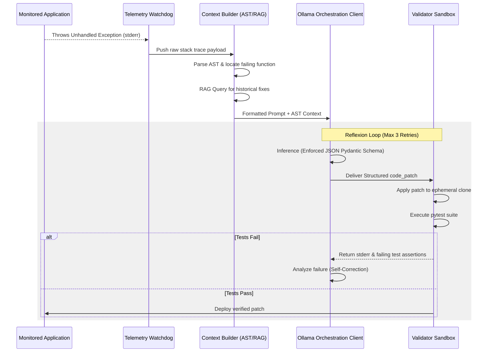

# Design Document: Autonomous Self-Healing Agent Integration via Ollama

## 1. System Overview

The Healing Agent is an autonomous, machine-driven anomaly resolution service integrated within the `chaos-and-recovery-agent` ecosystem. Powered by a local Large Language Model (LLM) via the Ollama platform and its official Python SDK, the agent fundamentally shifts incident management from a reactive, human-driven process to a proactive, self-healing workflow.

The primary objective of the Healing Agent is to continuously monitor system telemetry and logs, detect unhandled exceptions or anomalies, and autonomously generate, validate, and apply corrective code patches or configuration changes. By operating entirely on local hardware or managed internal clusters via Ollama, the system guarantees zero data exfiltration, strict privacy compliance, and circumvents the latency and recurring API costs associated with cloud-based AI providers.

The agent's development and operational lifecycle strictly adheres to SOLID, DRY, and KISS engineering principles. Furthermore, a rigorous Test-Driven Development (TDD) approach is mandated. The fundamental assumption of the system is that LLM outputs are inherently untrusted and prone to hallucination; therefore, no generative AI output is applied to the live environment without first passing an isolated, automated unit testing validation suite.

## 2. System Architecture

The Healing Agent abandons monolithic design in favor of a highly decoupled, event-driven microservices architecture. This ensures fault tolerance; the failure of the monitored application will not cascade into the failure of the Healing Agent.

The architecture is built upon three core operational patterns:

- **The Observe-Orient-Decide-Act (OODA) Framework:** This continuous feedback loop drives the core microservice workflow. The agent observes telemetry, orients itself by parsing the failing Abstract Syntax Tree (AST), decides on a fix via Ollama inference, and acts by validating and deploying the patch.
- **The Orchestrator-Worker Pattern:** To optimize local compute resources, a central Orchestrator LLM (e.g., a lightweight 1.5B/3B model like Llama 3.2 or Qwen) triages incoming errors. Simple syntax issues are handled directly. Complex logical faults are dynamically delegated to a larger, more capable Worker model (e.g., DeepSeek-R1 8B or Llama 3.1 8B) for deep reasoning.
- **The Reflexion (Self-Healing) Pattern:** Standard linear LLM chains are brittle. If the validation sandbox rejects a proposed code patch (e.g., due to a failed unit test), the resulting stderr output is captured and fed back into the Ollama model. The LLM is prompted to reason about its previous failure and generate a revised patch, looping until the test passes or a retry limit is reached.

## 3. System Components

The agent is modularized into specialized, single-responsibility Python components.

### 3.1 Telemetry and Event Watchdog

This module acts as the sensory input, utilizing continuous filesystem event listeners and log-tailing mechanisms to intercept execution failures. It integrates directly with local telemetry streams, extracting standard error outputs, stack traces, and relevant git commit hashes. It performs no analytical processing, serving strictly to place raw fault payloads onto an asynchronous message queue.

### 3.2 Context Builder and AST Analyzer

To provide the LLM with localized lexical scope, this module parses the failing application's Abstract Syntax Tree (AST) using Python's built-in `ast` module. It extracts the specific enclosing function or class associated with the stack trace line number. It also generates vector embeddings of the error to query a historical vector database, appending proven past solutions to the LLM's prompt via Retrieval-Augmented Generation (RAG).

### 3.3 Ollama Orchestration Client Interface

This module wraps the official `ollama` Python SDK (specifically the `AsyncClient` for non-blocking I/O) to handle inference communication. It constructs dynamic prompts and enforces strict JSON-structured outputs. By leveraging Pydantic, the agent passes `format=Model.model_json_schema()` to the Ollama API, ensuring the model's response maps deterministically to a structured Python object containing fields like `rationale` and `code_patch`.

It also tracks performance telemetry provided by the Ollama API payload—specifically `eval_count` (output tokens) and `eval_duration` (time spent generating)—to continuously calculate the system's Output Tokens Per Second (TPS) using the following formula:

$$TPS = \frac{\text{eval\_count}}{\text{eval\_duration} \times 10^{-9}}$$

### 3.4 Execution and Validator Sandbox

To uphold the TDD mandate, this component intercepts the LLM's proposed `code_patch` and stages it in an ephemeral execution environment. It dynamically invokes `pytest` to run existing and newly generated regression tests against the patched code

- **Success:** If the exit code is 0, the patch is merged.
- **Failure:** The module intercepts the failed assertion data, triggering the Reflexion loop.
- **TDD Mocking Layer:** For testing the agent itself without hitting the real Ollama REST API (which is slow and non-deterministic), this module heavily utilizes `pytest-mock` and `unittest.mock.patch` to intercept the `ollama.chat` method, injecting simulated token streams and JSON responses.

## 4. Sequence Diagrams

The following sequence illustrates the autonomous Reflexion loop initiated when an anomaly is detected.

## 5. Interfaces with existing local Docker Environment

The Healing Agent heavily interfaces with the local containerized infrastructure to monitor applications and spin up secure, isolated environments for validation.

- **Python Docker SDK Integration:** The agent utilizes the `docker-py` library (pip install docker) to interact programmatically with the local Docker daemon. Using `client = docker.from_env()`, the agent can autonomously spin up ephemeral containers to sandbox and execute the LLM's proposed code patches securely without risking the host machine. If a monitored service becomes entirely unresponsive, the agent can issue automated `client.containers.get('service_name').restart()` commands as a temporary mitigation.

- **LogQL and Grafana Loki Telemetry:** For monitoring the existing Docker environment, the Watchdog component queries the local Grafana Loki instance using LogQL. By querying specific labels (e.g., `{container="backend-api"} |= "Exception"`), the agent programmatically tails container logs to detect application crashes.

- **Ollama Container Configuration:** To ensure the local Ollama LLM does not introduce high latency during the "Orient" and "Decide" phases, the Ollama Docker container is explicitly configured with the `OLLAMA_KEEP_ALIVE=24h` (or `-1`) environment variable. This interface adjustment forces the container to permanently pin the LLM weights inside the GPU VRAM, dropping the `load_duration` metric to zero and enabling near-instantaneous inference when an anomaly triggers an event.
