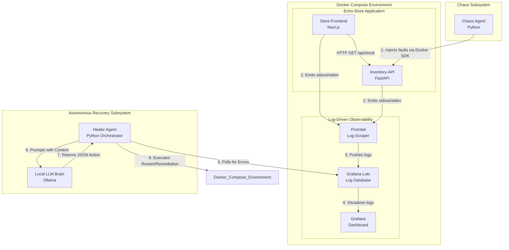
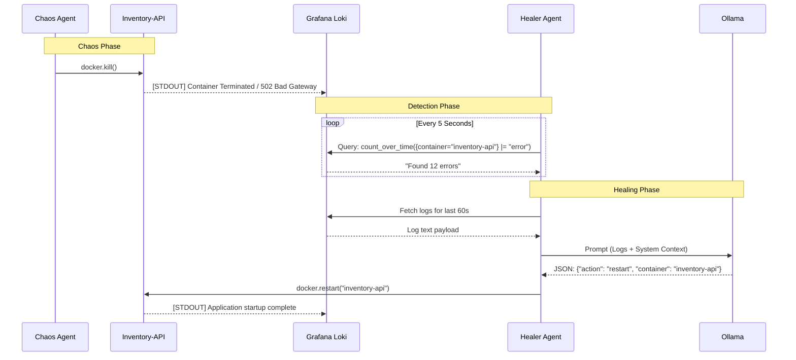
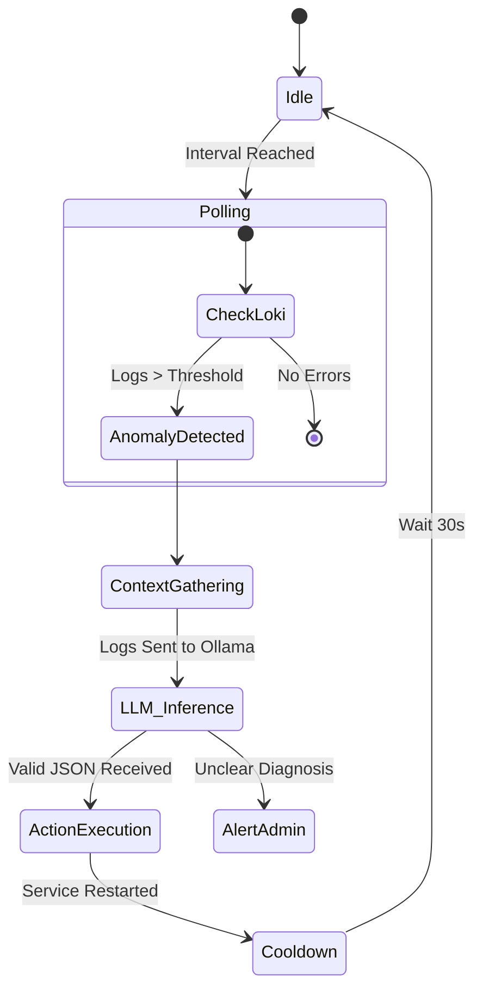
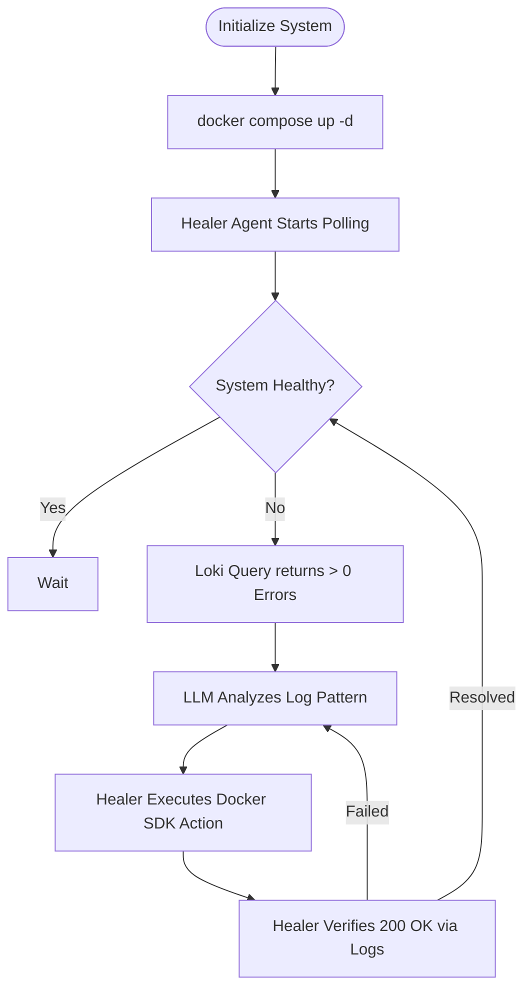

# Functional Design Document: Automated Chaos Engineering & Recovery System

## 1. Introduction

### 1.1 Purpose

This document outlines the functional architecture and design for an Automated Chaos Engineering and Recovery System. It demonstrates advanced Site Reliability Engineering (SRE) capabilities by proactively injecting faults into a local two-tier Docker microservices environment and autonomously diagnosing and remediating those faults using an LLM-driven agent.

### 1.2 Scope

The system operates entirely locally via **Docker Compose**. It utilizes a lightweight Echo-Store application (Next.js & FastAPI), a log-optimized observability stack (Grafana Loki & Promtail), a Python-based fault-injection engine (Chaos Agent), and an autonomous remediation engine (Healer Agent) powered by a local Large Language Model (**Ollama**).

## 2. System Overview

The architecture follows a closed-loop control system model. The Echo-Store environment is continuously monitored via container log streams. The Chaos Agent perturbs the system by introducing faults (e.g., container termination) into the `inventory-api`. The Healer Agent polls Loki for error signatures. Upon detection, it aggregates log context, leverages a local LLM to perform root-cause analysis, and executes **Docker SDK** commands to restore the service.

## 3. Component Architecture

The following diagram illustrates the structural components and the simplified log-based data flow within the Docker network.

## 4. Functional Requirements

### 4.1 Target Environment (Echo-Store)

- **Hosting:** Local Docker Engine via Docker Compose.
- **Store-Frontend (Service A):** Next.js App Router service. Uses SSR to fetch backend data. Renders a "System Degraded" UI on failure.
- **Inventory-API (Service B):** FastAPI service serving static JSON inventory data. Primary target for chaos injection.

### 4.2 Chaos Agent

- **Fault Injection:** Uses the Docker Python SDK to execute:
  - _State Faults:_ Killing or pausing the `inventory-api` container.
  - _Compute Faults:_ Artificially spiking CPU to induce latency logs.
- **Scheduling:** Operates on manual triggers or randomized "Attack Phases."

### 4.3 Observability Stack

- **Log Aggregation:** Promtail mounts `/var/run/docker.sock` to stream container logs to Loki.
- **Log Storage:** Loki indexed by `container` name and `job` labels.
- **Visualization:** Grafana provides real-time time-series graphs of error rates derived from log volume.

### 4.4 Healer Agent

- **Detection:** Periodically polls Loki using LogQL (e.g., `{job="docker-stream"} |= "error"`).
- **Diagnosis:** Fetches the 20 lines of logs surrounding an error and passes them to the local LLM.
- **Remediation:** Executes Docker SDK commands (e.g., `container.restart()`) based on LLM output.

### 4.5 Local LLM (Ollama)

- **Inference:** Hosted locally (zero cost).
- **Persona:** Configured to output machine-readable JSON containing the `target_container` and `action_required`.

## 5. System Workflows

### 5.1 Request Lifecycle (Sequence Diagram)

This diagram details the interaction during a fault event and subsequent autonomous healing.

### 5.2 Healer Agent Internal Logic (Activity Flow Diagram)

## 6. Operational Flow

## 7. Non-Functional Requirements

- **Resource Preservation:** Dropping VictoriaMetrics and Minikube reduces the RAM footprint by ~3GB, ensuring Ollama has sufficient priority.
- **Latency:** The "Detection to Remediation" loop should complete in under 15 seconds.
- **Security:** The Healer Agent requires access to the Docker Socket but is restricted to the specific Docker Network `chaos-net`.
- **Idempotency:** Remediation actions must be safe to run multiple times (e.g., restarting a container that is already starting).
