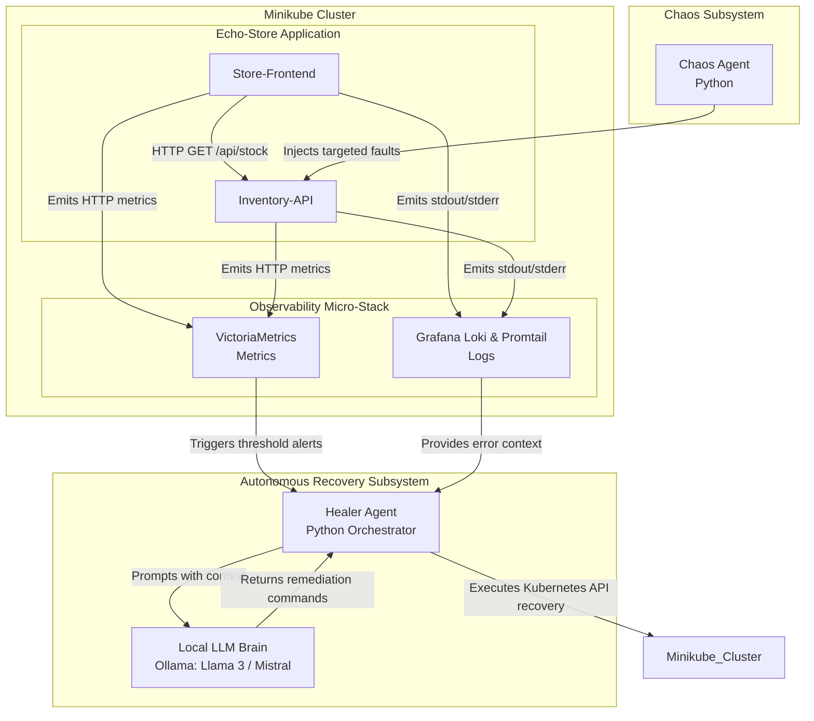
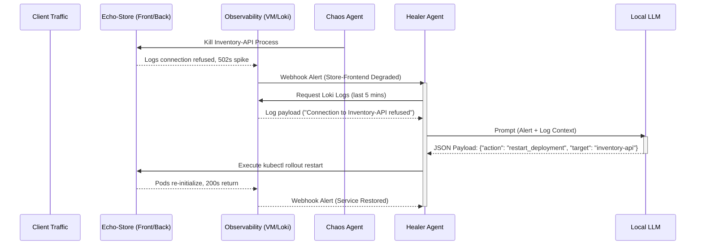
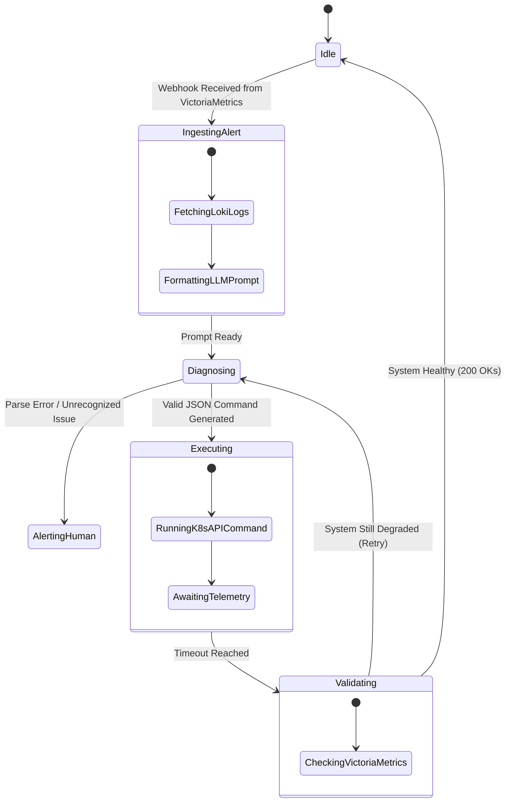
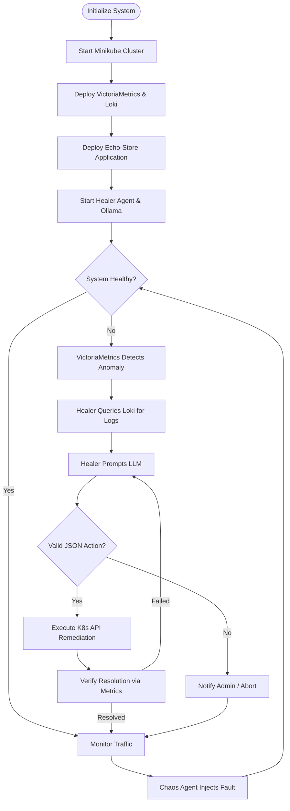

# Functional Design Document: Automated Chaos Engineering & Recovery System

## 1. Introduction

### 1.1 Purpose

This document outlines the functional architecture and design for an Automated Chaos Engineering and Recovery System. It demonstrates advanced Site Reliability Engineering (SRE) capabilities by proactively injecting faults into a local two-tier microservices environment and autonomously diagnosing and remediating those faults using an LLM-driven agent.

### 1.2 Scope

The system operates entirely locally to ensure zero cloud cost. It utilizes Minikube for orchestration, a lightweight Echo-Store dummy application, a resource-optimized observability stack (VictoriaMetrics and Loki), a Python-based fault-injection engine (Chaos Agent), and an autonomous remediation engine (Healer Agent) powered by a local Large Language Model (LLM).

## 2. System Overview

The architecture follows a closed-loop control system model optimized for local execution on a personal workstation. The Echo-Store environment is continuously monitored for baseline health. The Chaos Agent perturbs the system by introducing faults into the backend API. The observability layer registers the degradation, triggering the Healer Agent. The Healer Agent aggregates telemetry, leverages a local LLM to perform root-cause analysis, and translates the LLM's diagnostic output into actionable Kubernetes API calls to restore the service.

## 3. Component Architecture

The following component diagram illustrates the high-level structural components of the system, highlighting the lightweight tools selected to preserve local CPU and memory resources.

## 4. Functional Requirements

### 4.1 Target Environment (Echo-Store)

- **Hosting:** Minikube running locally.
- **Store-Frontend (Service A):** Exposes a `/products` endpoint. Makes synchronous calls to the backend. Returns 502/504 if the backend is unreachable.
- **Inventory-API (Service B):** Exposes an `/api/stock` endpoint. Returns static JSON data. Acts as the primary target for chaos injection.

### 4.2 Chaos Agent

- **Fault Injection:** Capable of executing predefined fault profiles against the `Inventory-API` pod:
  - _Compute:_ CPU spiking to trigger throttling.
  - _State:_ Pod deletion or process termination.
- **Scheduling:** Can trigger faults manually or on randomized intervals.

### 4.3 Observability Micro-Stack

- **Metrics Gathering:** VictoriaMetrics to scrape node and application-level metrics with a low memory footprint.
- **Log Aggregation:** Promtail and Grafana Loki to capture standard output/error logs efficiently without heavy text indexing.
- **Alerting:** Configured thresholds in VictoriaMetrics (e.g., HTTP 500 rate > 5% on `Store-Frontend`) to trigger webhooks to the Healer Agent.

### 4.4 Healer Agent

- **Ingestion:** Exposes a listener for VictoriaMetrics alerts.
- **Context Gathering:** Automatically queries Loki for a trailing 5-minute window of logs surrounding the alert timestamp for both Echo-Store services.
- **Execution:** Parses the JSON output from the LLM and executes the necessary Kubernetes Python Client commands (e.g., scaling replicas, restarting deployments).

### 4.5 Local LLM

- **Inference:** Hosted locally via Ollama to ensure low latency and zero API costs.
- **System Prompting:** Configured with a strict persona to output machine-parsable remediation steps (JSON format containing the specific CLI/API command).

## 5. System Workflows

### 5.1 System Interaction (Sequence Diagram)

This diagram details the chronological interaction between components during a fault and recovery lifecycle focused on the Echo-Store application.

### 5.2 Healer Agent Internal Logic (Activity Flow Diagram)

This diagram shows the internal state transitions and decision-making process of the Healer Agent.

## 6. Operational Flow

The following flowchart illustrates the overarching lifecycle of the entire system from deployment to steady-state operations.

## 7. Non-Functional Requirements

- **Resource Constraints:** The entire stack must operate within the memory constraints of a standard Windows PC. The Echo-Store microservices must consume < 50MB RAM each, and the observability stack must be tuned for minimal retention to prevent swapping.
- **Latency:** The total time from alert generation to remediation execution should not exceed 30 seconds to prevent cascading failures.
- **Safety Boundaries:** The Healer agent must use Role-Based Access Control (RBAC) restricted to a specific namespace to prevent cluster-wide modifications.
- **Idempotency:** Remediation commands executed via the Kubernetes API must be idempotent to avoid compounding errors if executed multiple times.
