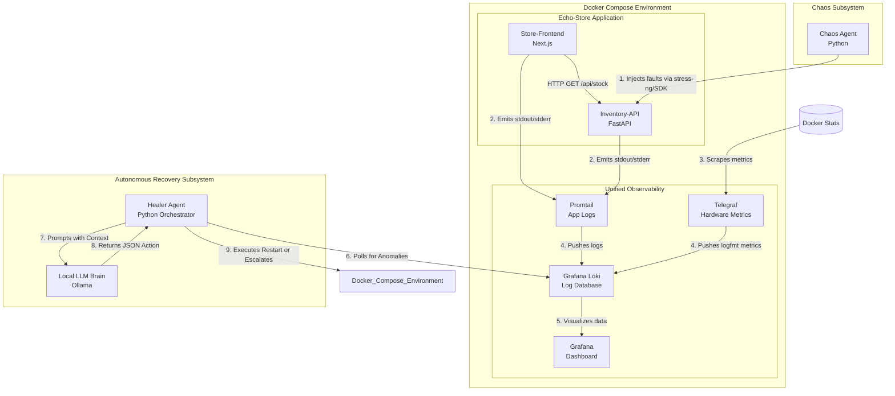
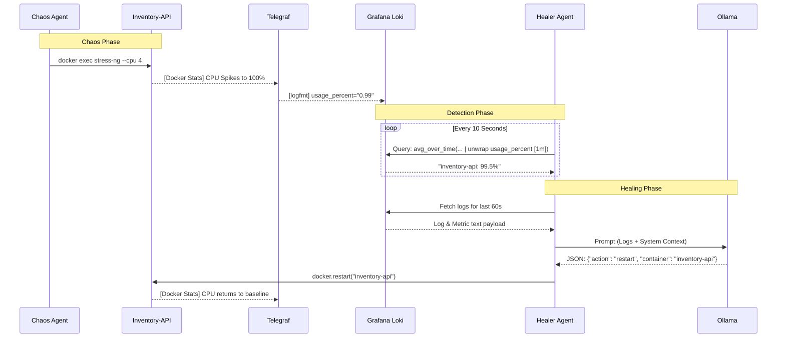
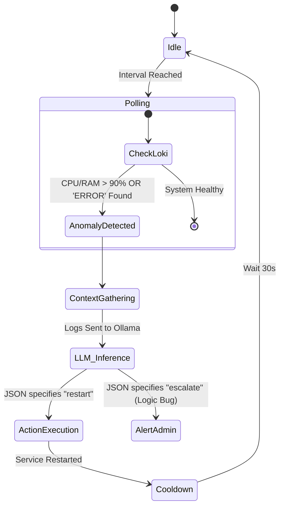
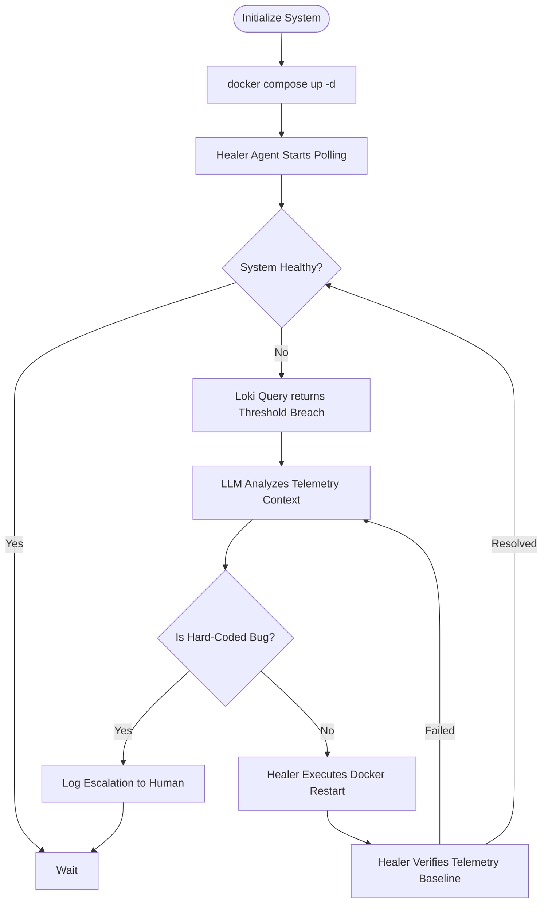

# Functional Design Document: Automated Chaos Engineering & Recovery System

## 1. Introduction

### 1.1 Purpose

This document outlines the functional architecture and design for an Automated Chaos Engineering and Recovery System. It demonstrates advanced Site Reliability Engineering (SRE) capabilities by proactively injecting faults into a local two-tier Docker microservices environment and autonomously diagnosing and remediating those faults using an LLM-driven agent.

### 1.2 Scope

The system operates entirely locally via **Docker Compose**. It utilizes a lightweight Echo-Store application (Next.js & FastAPI), a log-optimized observability stack (Grafana Loki, Promtail, & Telegraf), a Python-based fault-injection engine (Chaos Agent), and an autonomous remediation engine (Healer Agent) powered by a local Large Language Model (**Ollama**).

## 2. System Overview

The architecture follows a closed-loop control system model based on the Observe-Orient-Decide-Act (OODA) loop. The Echo-Store environment is continuously monitored via container log streams and hardware metrics. The Chaos Agent perturbs the system by introducing faults (e.g., CPU starvation, memory leaks, explicit application exceptions). The Healer Agent polls Loki for metric anomalies and error signatures. Upon detection, it aggregates context, leverages a local LLM to perform root-cause analysis, and executes **Docker SDK** commands to restore the service or escalates to a human engineer if the issue is a hard-coded bug.

## 3. Component Architecture

The following diagram illustrates the structural components and the unified telemetry data flow within the Docker network.

## 4. Functional Requirements

### 4.1 Target Environment (Echo-Store)

- **Hosting:** Local Docker Engine via Docker Compose.
- **Store-Frontend (Service A):** Next.js App Router service. Uses SSR to fetch backend data. Renders a "System Degraded" UI on failure.
- **Inventory-API (Service B):** FastAPI service serving static JSON inventory data. Primary target for chaos injection.

### 4.2 Chaos Agent

- **Fault Injection:** Uses the Docker Python SDK and runtime exec commands to execute:
  - _Compute Faults:_ Artificially spiking CPU (`stress-ng --cpu`) to induce latency and starvation.
  - _Memory Faults:_ Forcing rapid RAM allocation (`stress-ng --vm-populate`) to induce OOM risks.
  - _Code Faults:_ Injecting explicit Python/Node exceptions into the output stream to test escalation logic.
- **Scheduling:** Operates on manual triggers or randomized "Attack Phases."

### 4.3 Observability Stack (Sanitized Telemetry)

- **Log Aggregation:** Promtail mounts `/var/run/docker.sock` to stream container logs to Loki.
- **Metric Ingestion:** Telegraf scrapes Docker hardware metrics, converts complex tags to fields to satisfy Loki's strict label parser, and pushes them in `logfmt`.
- **Visualization:** Grafana provides real-time time-series graphs of error rates and resource consumption derived from `unwrap` LogQL queries.

### 4.4 Healer Agent

- **Detection:** Periodically polls Loki using LogQL for both metrics (e.g., `avg_over_time({job="debug_metrics"} | logfmt | unwrap usage_percent [1m]) > 90`) and raw errors.
- **Diagnosis:** Fetches the surrounding logs and metrics, passing them to the local LLM.
- **Remediation & Escalation:** Executes Docker SDK commands (e.g., `container.restart()`) based on LLM output. Strictly escalates (logs only) if the LLM diagnoses a logical source-code bug.

### 4.5 Local LLM (Ollama)

- **Inference:** Hosted locally (zero cost, zero data exfiltration).
- **Persona:** Configured via strict system prompts to output machine-readable JSON (validated via Pydantic) containing the `target_container` and `action_required`.

## 5. System Workflows

### 5.1 Request Lifecycle (Sequence Diagram)

This diagram details the interaction during a hardware starvation fault event and subsequent autonomous healing.

### 5.2 Healer Agent Internal Logic (Activity Flow Diagram)

## 6. Operational Flow

## 7. Non-Functional Requirements

- **Resource Preservation:** Using lightweight telemetry (Loki + Telegraf `logfmt` instead of Prometheus/VictoriaMetrics) reduces the RAM footprint, ensuring Ollama has sufficient compute priority.
- **Latency:** The "Detection to Remediation" loop should complete in under 15 seconds.
- **Security:** The Healer Agent requires access to the Docker Socket but is restricted to the specific Docker Network `chaos-net`. Operations are strictly non-destructive to application code.
- **Idempotency:** Remediation actions must be safe to run multiple times (e.g., checking container state before issuing a restart).
