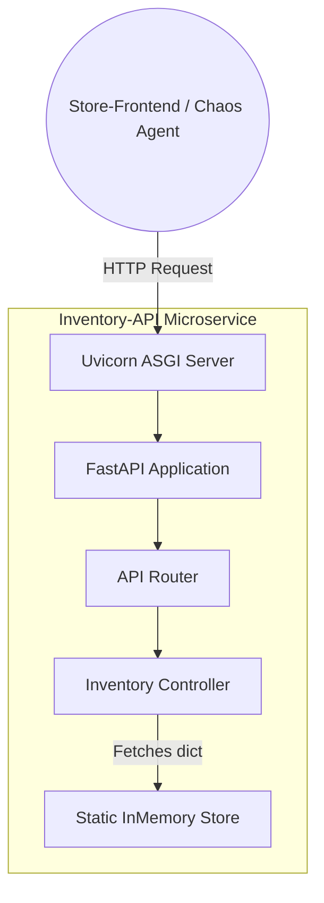
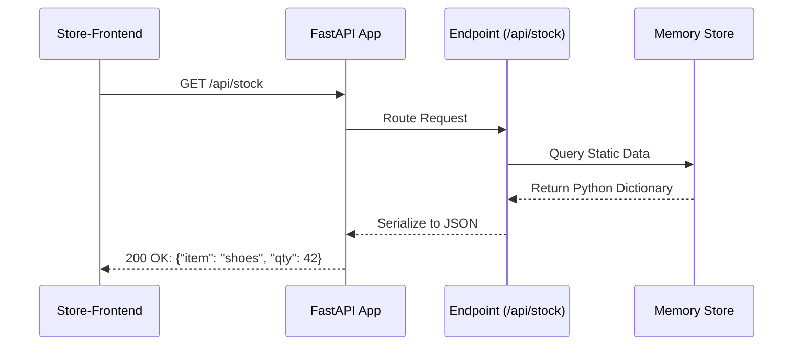
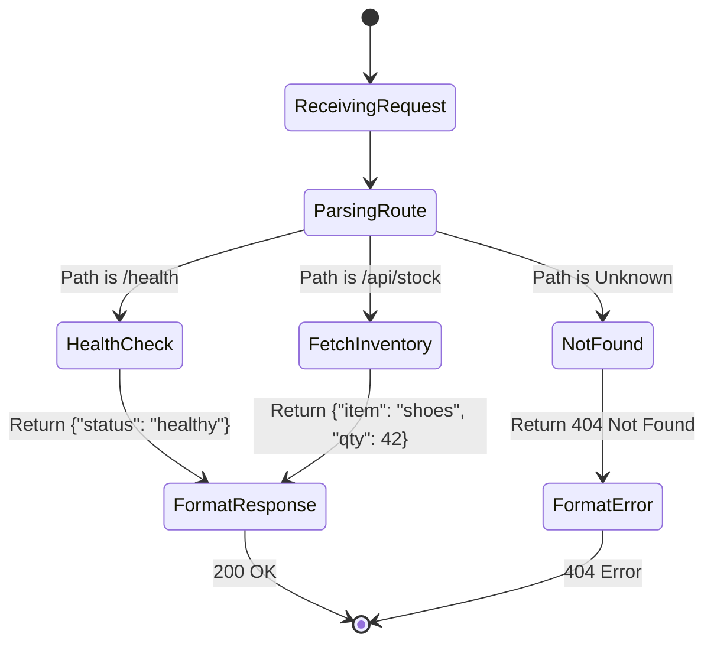
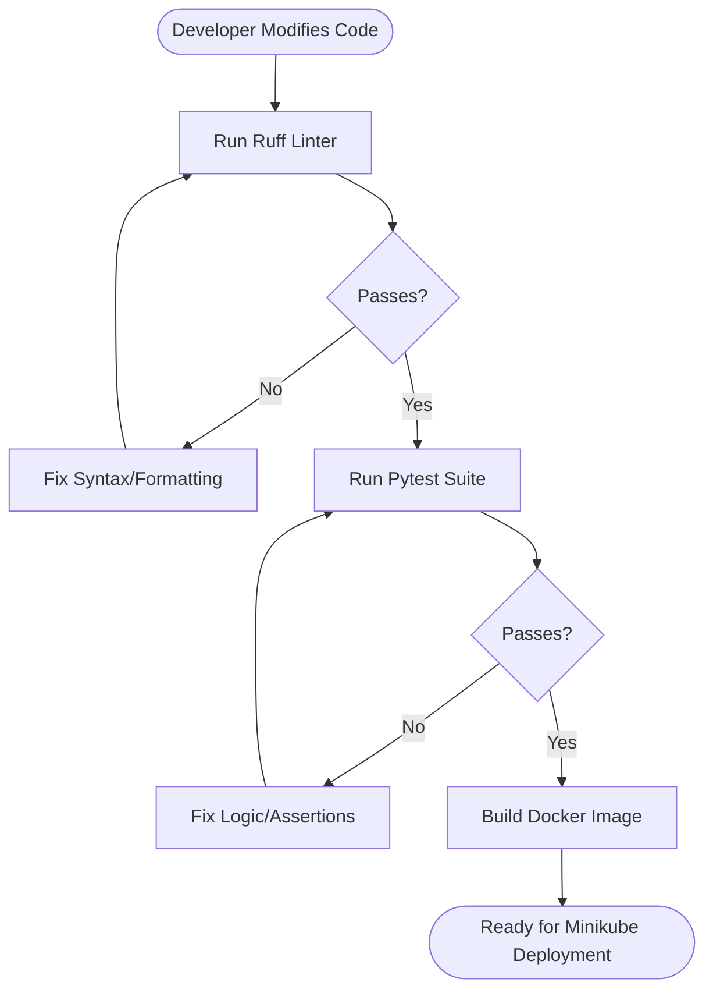

# Functional Design Document: Inventory API Service

## 1. Introduction

### 1.1 Purpose

This document outlines the functional design for the `inventory-api` microservice. As the backend component of the Echo-Store application, its primary role is to serve static inventory data to the frontend and act as the target for the Automated Chaos Engineering System.

### 1.2 Scope

The service is intentionally lightweight. It will not connect to an external database. Instead, it will serve static JSON payloads from memory to ensure predictable sub-millisecond response times during normal operations, making latency spikes injected by the Chaos Agent highly visible.

## 2. Technology Stack

- **Language:** Python 3.11+
- **Framework:** FastAPI (High performance, async-ready, built-in OpenAPI validation)
- **Server:** Uvicorn (ASGI web server implementation for Python)
- **Testing:** Pytest (Standardized unit testing)
- **Linting & Formatting:** Ruff (Extremely fast Python linter and code formatter written in Rust)

## 3. Component Architecture

The application follows a standard layered architectural pattern, even for static data, to demonstrate enterprise best practices and allow for future scalability.



## 4. API Specifications

| Endpoint     | Method | Purpose                                    | Expected Response                        | HTTP Status |
| :----------- | :----- | :----------------------------------------- | :--------------------------------------- | :---------- |
| `/api/stock` | GET    | Retrieves current inventory levels         | JSON object containing item and quantity | 200 OK      |
| `/health`    | GET    | Kubernetes liveness/readiness probe target | JSON object indicating service status    | 200 OK      |

## 5. System Workflows

### 5.1 Request Lifecycle (Sequence Diagram)

This diagram illustrates the synchronous flow of a data request through the FastAPI layers.



### 5.2 Internal Logic (Activity Flow Diagram)

This diagram maps the internal decision-making process when the service receives traffic, including how it handles standard Kubernetes health checks.



## 6. Development & Quality Assurance Flow

To enforce code quality before deployment, the service utilizes Ruff and Pytest. The following flowchart dictates the required steps for modifying this service.



## 7. Project Directory Structure

The following tree represents the internal structure of the `services/inventory-api/` directory within your monorepo. It separates application code (`src`), dependencies, test configurations, and deployment instructions.

```text
inventory-api/
├── pyproject.toml               # Configuration for Ruff and Pytest
├── requirements.txt             # Python package dependencies (fastapi, uvicorn, etc.)
├── Dockerfile                   # Instructions for building the container image
├── src/                         # Main application source code
│   ├── __init__.py
│   ├── main.py                  # FastAPI instance and route definitions
│   └── data.py                  # Static in-memory dictionary
└── tests/                       # Unit test directory
    ├── __init__.py
    └── test_main.py             # Pytest assertions for /api/stock and /health
```
