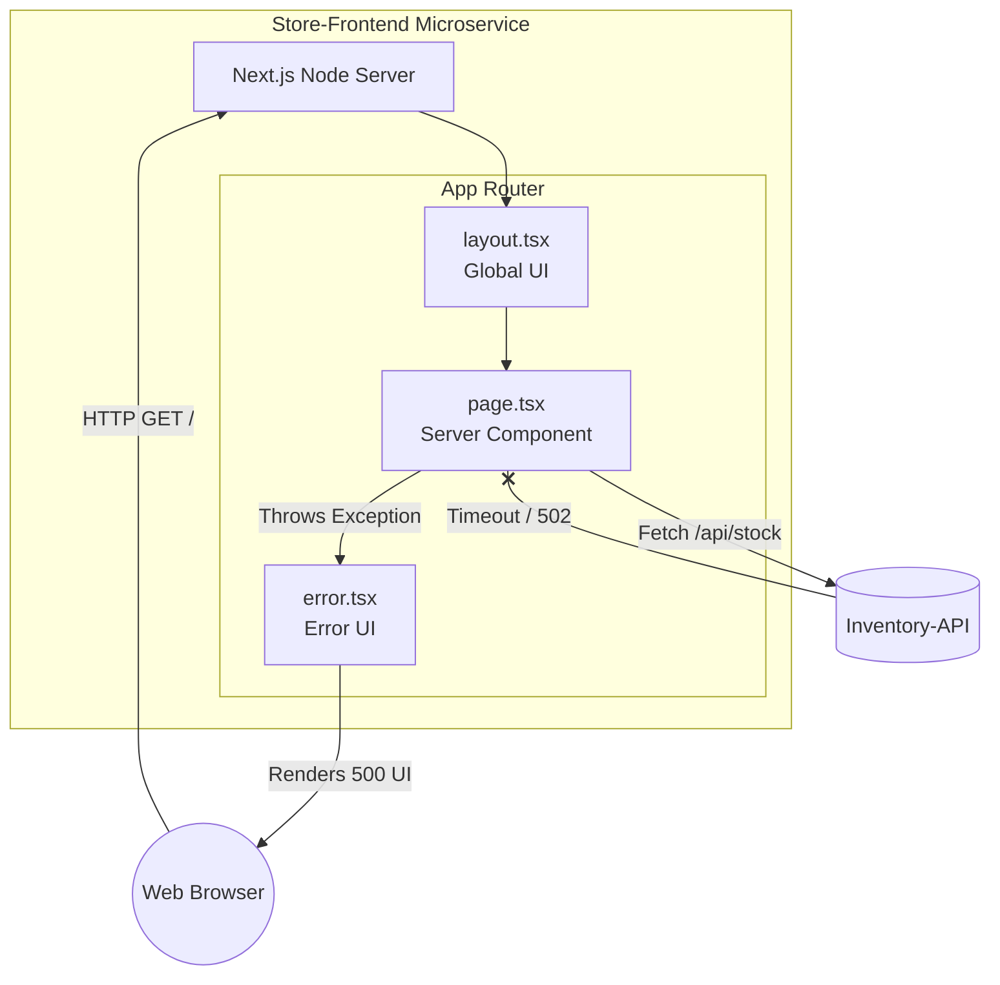
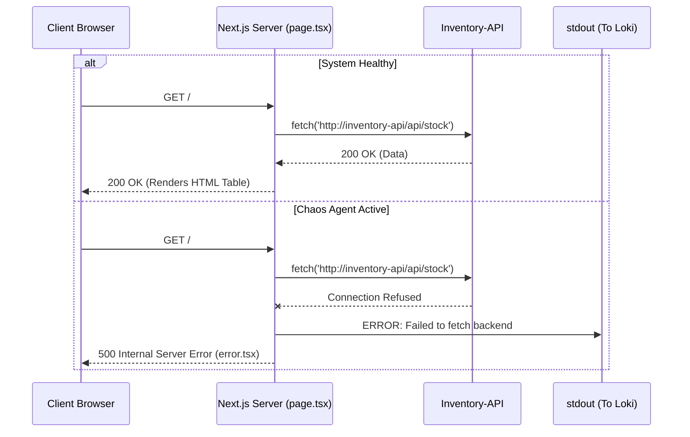
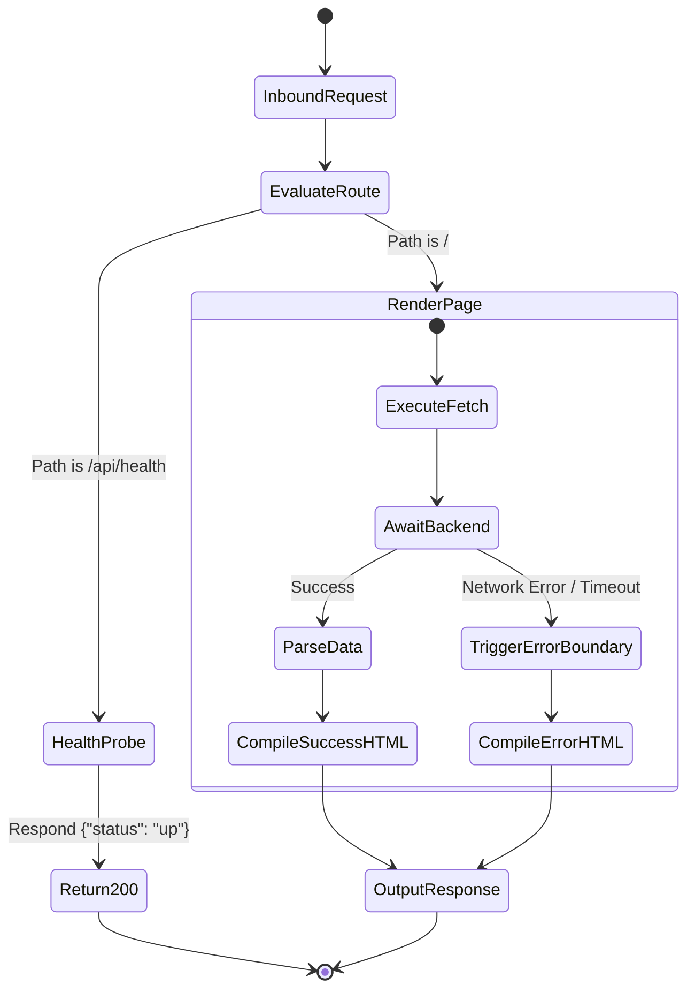
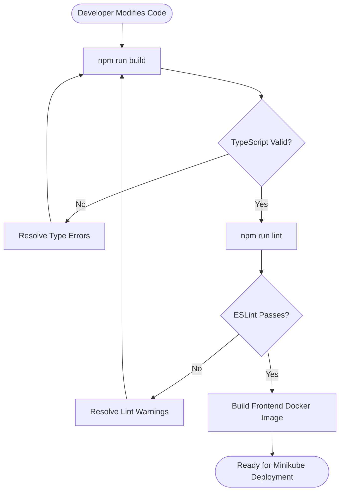

# Functional Design Document: Store Frontend Service

## 1. Introduction

### 1.1 Purpose

This document details the functional architecture of the `store-frontend` microservice. Serving as the user-facing tier of the Echo-Store application, its primary function is to render inventory data and, critically for this project, to visibly and programmatically reflect cascading failures when the backend `inventory-api` is targeted by the Chaos Agent.

### 1.2 Scope

The service utilizes Server-Side Rendering (SSR) to ensure backend dependency failures are caught at the server level before reaching the client. This allows the Node.js server to emit definitive 500-level HTTP errors and standard output logs, which are scraped by VictoriaMetrics and Loki to trigger the Healer Agent.

## 2. Technology Stack

- **Framework:** Next.js (utilizing the App Router paradigm)
- **Language:** TypeScript (for strict type contracts with the backend JSON responses)
- **Styling:** Tailwind CSS (lightweight, utility-first UI)
- **Linting:** ESLint (Next.js core web vitals configuration)
- **Runtime:** Node.js

## 3. Component Architecture

The architecture leverages Next.js Server Components. The client browser never interacts directly with the `inventory-api`. Instead, the Next.js server acts as a gateway, fetching data and returning compiled HTML.



## 4. Route Specifications & UI Behavior

| Route         | File                      | Purpose                                                           | Chaos Response Behavior                                                                        |
| :------------ | :------------------------ | :---------------------------------------------------------------- | :--------------------------------------------------------------------------------------------- |
| `/` (Home)    | `app/page.tsx`            | Fetches and displays the static inventory data from the backend.  | If the backend is healthy, renders the data table.                                             |
| `/` (Error)   | `app/error.tsx`           | Catches exceptions thrown by `page.tsx` during SSR data fetching. | Renders a high-visibility "System Degraded" UI and ensures the server logs the error for Loki. |
| `/api/health` | `app/api/health/route.ts` | Route Handler for Kubernetes liveness probes.                     | Returns 200 OK as long as the Next.js process itself is running.                               |

## 5. System Workflows

### 5.1 Request Lifecycle (Sequence Diagram)

This diagram maps the distinct responses between a healthy system state and an active chaos event.



### 5.2 Internal Rendering Logic (Activity Flow Diagram)

This diagram illustrates the App Router's execution path when a user navigates to the application.



## 6. Development & Quality Assurance Flow

The following flowchart dictates the required steps for modifying the Next.js frontend, ensuring TypeScript integrity and clean linting before the Docker image is built.



## 7. Project Directory Structure

This is the standard Next.js App Router structure, tailored for your monorepo under `services/store-frontend/`.

````text
store-frontend/
├── src/
│   ├── app/
│   │   ├── api/
│   │   │   └── health/
│   │   │       └── route.ts         <-- Health check endpoint
│   │   ├── error.tsx                <-- Global Error Boundary
│   │   └── page.tsx                 <-- Gateway Server Component (Home)
│   │
│   ├── components/
│   │   └── ui/
│   │       ├── InventoryTable.tsx   <-- UI Component
│   │       └── StatusBadge.tsx      <-- UI Component
│   │
│   └── lib/
│       └── logger.ts                <-- Logger Utility
│
├── next.config.ts                   <-- Config stays at the root
└── package.json                     <-- Package.json stays at the root
```
````
